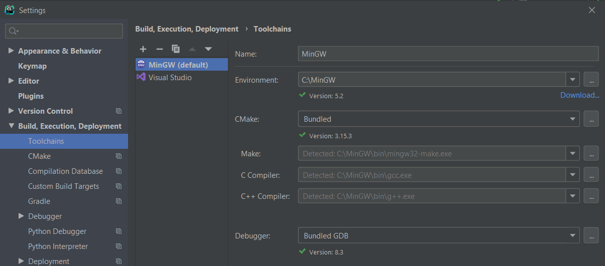

# Rendu exercices C++
Par Florian Lafuente

## Rappel des consignes : 
1) Ecrire une fonction swap qui a comme paramètres deux pointeurs vers des entiers et qui échange le contenu des deux entiers pointés.
2) Ecrire une fonction qui a comme paramètres un tableau d'entiers de taille quelconque, la taille du tableau, et 2 pointeurs vers des entiers min et max. La fonction doit renvoyer dans les entiers pointés par min et max respectivement les plus petits et les plus grands entiers du tableau. 
3) Ecrire une fonction qui prend en paramètre un pointeur vers un tableau, qui demande à l’utilisateurs de rentrer 5 nombres et qui remplis le tableau grâce au pointeur.

## Rendu
Les trois exercices se lancent à la suite dans le main (une fonction pour chaque exercice).

Pour lancer le rendu :

    $ git clone https://github.com/paralixo/rendu_exos_cpp.git
    $ cd rendu_exos_cpp
    $ ./cmake-build-debug/exos.exe

Les fichiers `MakeFile, CMakeLists, ...` ont été autogénérés par l'IDE CLion (JetBrains).

Configuration CLion : 

